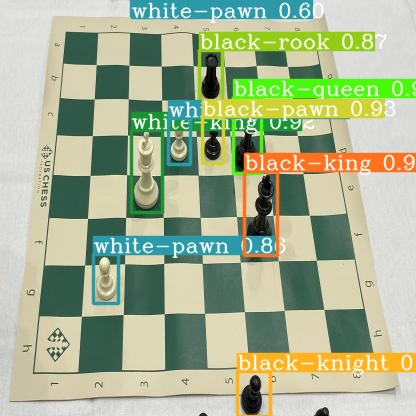

<div id="top"></div>


<br />
<div align="center">
  <a href="https://github.com/MNourbakhsh75/NN_CA3">
    
  </a>

  <h3 align="center">Yolov6 Object Detection</h3>

  <p align="center">
    Neural Networks Course Assignment - Fall 2022 - University of Tehran
    
</div>


<!-- TABLE OF CONTENTS -->
<details>
  <summary>Table of Contents</summary>
  <ol>
    <li>
      <a href="#about-the-project">About The Project</a>
    </li>
    <li>
      <a href="#built-with">Built With</a>
    </li>
    <li><a href="#useful-links">Useful Links</a></li>
    <li><a href="#contact">Contact</a></li>
  </ol>
</details>


<!-- ABOUT THE PROJECT -->
## About The Project


The objective of this project was to fine-tune Yolov6 for the chess dataset in <a href="https://public.roboflow.com/object-detection/chess-full">this link</a>. The implementation is in <a href="https://github.com/MNourbakhsh75/NN_CA3/blob/main/yolov6.ipynb">```yolov6.ipynb```</a>

[](https://colab.research.google.com/drive/1q1qQGLaYurIhxGBWu2HqePumlu2lE6Q0?usp=sharing)

## Built With

The programming language, frameworks, and technologies used in the project are listed here:

* Python


<p align="right">(<a href="#top">back to top</a>)</p>


## Useful Links

Some useful links and tutorials about this project can be found here:

* [Yolov6](https://github.com/meituan/YOLOv6)
* [YOLOv6 on Custom dataset](https://www.youtube.com/watch?v=3hqkbqJ5ag8)

<p align="right">(<a href="#top">back to top</a>)</p>


<!-- CONTACT -->
## Contact

Mehrdad Nourbakhsh - mehrdad.nb4@gmail.com

<p align="right">(<a href="#top">back to top</a>)</p>
